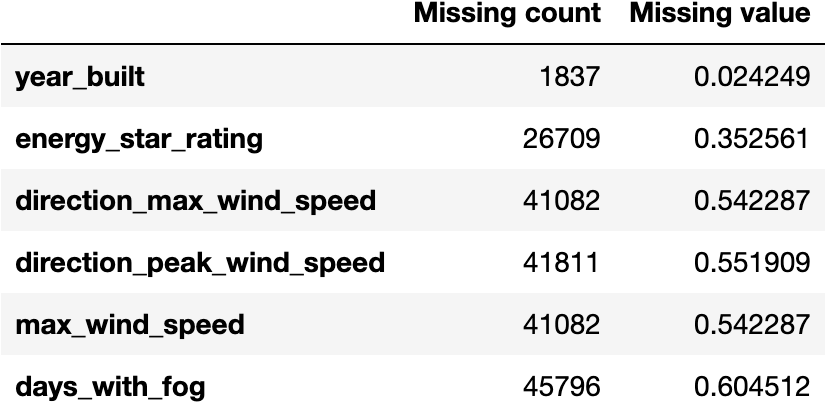
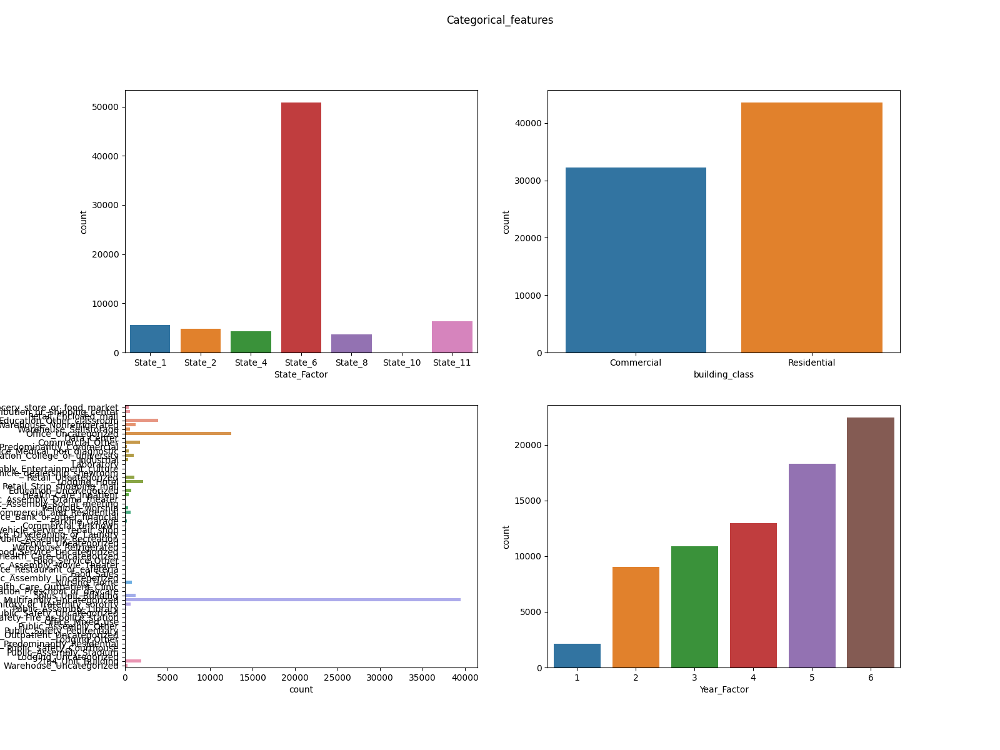
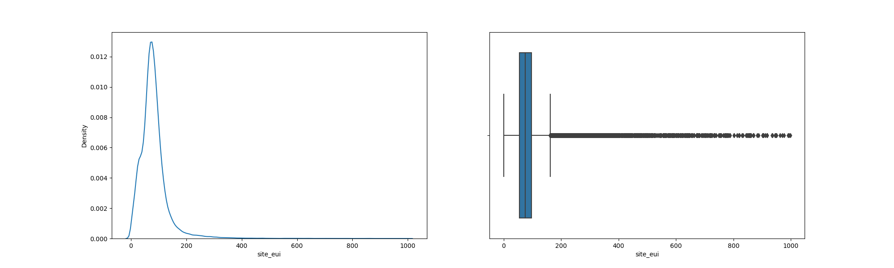

# WiDS Datathon 2022: predict building energy effiency

## Introduction
**Goal**
The goal of this competition is to predict the energy consumption using building characteristics, climate and weather variables.

**Data**
The WiDS Datathon 2022 focuses on a prediction task involving roughly 100k observations of building energy usage records collected over 7 years and a number of states within the **United States**. The dataset consists of building characteristics (e.g. floor area, facility type etc), weather data for the location of the building (e.g. annual average temperature, annual total precipitation etc) as well as the energy usage for the building and the given year, measured as Site Energy Usage Intensity (Site EUI). Each row in the data corresponds to the a single building observed in a given year. Your task is to predict the Site EUI for each row, given the characteristics of the building and the weather data for the location of the building.

### Steps performed
1. Import libraries and data set
2. Data exploration:
* missing values
* categorical values distribution
* numerical values distribution
* target value distribution
* relation between categorical variable and target variable
* relation between numerical variable and target variable

3. Data preprocessing
* missing value
* label encoding
* data correlation and dataset reduction
* scale numerical features
* outliers

4. Modeling
5. Future directions 

## 1. Import libraries and dataset
```python
import pandas as pd
import seaborn as sns
import matplotlib.pyplot as plt
import numpy as np
from sklearn.preprocessing import LabelEncoder
from sklearn.preprocessing import StandardScaler
from sklearn.model_selection import train_test_split
import catboost as cb
from catboost import CatBoostRegressor

train = pd.read_csv("train.csv")
test = pd.read_csv("test.csv")
categorical_features = ["State_Factor", "building_class", 'facility_type', 'Year_Factor']
numerical_features = train.select_dtypes('number').columns
ordinal_cols = ['year_built', 'energy_star_rating']
```
##### Comment: 
The traininig dataset has 75757 rows and 64 columns.
The test dataset has 9705 rows and 63 columns. The EUI variable misses because it is the target to predict. 

## 2. Data exploration
#### 2a. missing values
``` python
missing_col = [col for col in train.columns
               if train[col].isnull().any()]
miss_count = train.isna().sum()
miss_df = (pd.concat([miss_count.rename('Missing count'), miss_count.div(len(train)).rename('Missing value')], axis=1).loc[
        miss_count.ne(0)])
miss_df.style.background_gradient(cmap="coolwarm")
miss_df.to_excel("missing_data.xlsx")
```


#### 2b. categorical values distribution
```python
fig = plt.figure()
fig, ax = plt.subplots(2, 2, figsize=(16, 12), sharey=False)
state = sns.countplot(x=train['State_Factor'], label='State_factor', ax=ax[0, 0])
building_class = sns.countplot(x=train['building_class'], label='building_class', ax=ax[0, 1])
facility_type = sns.countplot(y=train['facility_type'], label='facility_type', ax=ax[1, 0])
year_factor = sns.countplot(x=train['Year_Factor'], label='year_factor', ax=ax[1, 1])
plt.suptitle('Categorical_features')
plt.show()
```


#### 2c. numerical values distribution
```python
for feature in numerical_features:
    sns.kdeplot(train[feature])
    plt.show()
```

#### 2d. target variable distribution
```python
fig = plt.figure()
fig, ax = plt.subplots(1, 2, figsize=(20, 6), sharey=False)
sns.kdeplot(x=train['site_eui'], ax=ax[0])
sns.boxplot(x=train['site_eui'], ax=ax[1])
plt.show()
fig.savefig("target_distribution.png")
```


#### 2e. relation between categorical variables and target variable
[//]: <> (to rewrite code)
```python
def catplot(df, color):
    for i, col in enumerate(['facility_type', 'State_Factor', 'building_class']):
        sns.catplot(x=col, y='site_eui', data=df, kind='point', aspect=3, color=color)
        plt.xticks(rotation=90)
        plt.show()
catplot(train, "green")
```
##### Comment:
Residential building has average EUI at 80.24
Commercial building has average EUI at 85.76

#### 2f. relation between numerical variables and target variable
[//]: <> (to rewrite code)
```python
def catplot(df, color):
    for i, col in enumerate(['energy_star_rating', 'year_built', 'cooling_degree_days',
                             'heating_degree_days']):
        sns.catplot(x=col, y='site_eui', data=df, kind='point', color=color)
        plt.xticks(rotation=90)
        plt.show()
catplot(train, "green")
```
#### 2f. checking highly correlated numerical features (temp, wind, snow, etc)
```python
num_cols = ['floor_area', 'ELEVATION',
       'january_min_temp', 'january_avg_temp', 'january_max_temp',
       'february_min_temp', 'february_avg_temp', 'february_max_temp',
       'march_min_temp', 'march_avg_temp', 'march_max_temp', 'april_min_temp',
       'april_avg_temp', 'april_max_temp', 'may_min_temp', 'may_avg_temp',
       'may_max_temp', 'june_min_temp', 'june_avg_temp', 'june_max_temp',
       'july_min_temp', 'july_avg_temp', 'july_max_temp', 'august_min_temp',
       'august_avg_temp', 'august_max_temp', 'september_min_temp',
       'september_avg_temp', 'september_max_temp', 'october_min_temp',
       'october_avg_temp', 'october_max_temp', 'november_min_temp',
       'november_avg_temp', 'november_max_temp', 'december_min_temp',
       'december_avg_temp', 'december_max_temp', 'cooling_degree_days',
       'heating_degree_days', 'precipitation_inches', 'snowfall_inches',
       'snowdepth_inches', 'avg_temp', 'days_below_30F', 'days_below_20F',
       'days_below_10F', 'days_below_0F', 'days_above_80F', 'days_above_90F',
       'days_above_100F', 'days_above_110F', 'direction_max_wind_speed',
       'direction_peak_wind_speed', 'max_wind_speed', 'days_with_fog']
feat = num_cols + ['site_eui']
corr = train[feat].corr()
corr.style.background_gradient(cmap='coolwarm')
corr.to_excel("corr_eui.xlsx")
```
#### 2g. outliers
```python
fig = plt.figure()
train.boxplot(column =['days_with_fog'], grid = False)
plt.show()
train['days_wth_fog'].describe()
```
[//]: <> (insert figure)

## 3. Data preprocessing

#### 3a. missing values
##### Comment
Missing values have been replaced with the median
```python
train.isnull().sum()
train['year_built'] =train['year_built'].replace(np.nan, train['year_built'].median()) # anno median
train['energy_star_rating']=train['energy_star_rating'].replace(np.nan,train['energy_star_rating'].median()) #medio per: anno di costruzione, domanda energetica per metro quadro, categoria di edificio sullo star rating
train['direction_max_wind_speed']= train['direction_max_wind_speed'].replace(np.nan,train['direction_max_wind_speed'].median())
train['direction_peak_wind_speed']= train['direction_peak_wind_speed'].replace(np.nan,train['direction_peak_wind_speed'].median())
train['max_wind_speed']=train['max_wind_speed'].replace(np.nan,train['max_wind_speed'].median())
train['days_with_fog']=train['days_with_fog'].replace(np.nan,train['days_with_fog'].median())

test['year_built'] =test['year_built'].replace(np.nan, test['year_built'].median())
test['energy_star_rating']=test['energy_star_rating'].replace(np.nan,test['energy_star_rating'].median())
test['direction_max_wind_speed']= test['direction_max_wind_speed'].replace(np.nan,test['direction_max_wind_speed'].median())
test['direction_peak_wind_speed']= test['direction_peak_wind_speed'].replace(np.nan,test['direction_peak_wind_speed'].median())
test['max_wind_speed']=test['max_wind_speed'].replace(np.nan,test['max_wind_speed'].median())
test['days_with_fog']=test['days_with_fog'].replace(np.nan,test['days_with_fog'].median())
```
#### 3b. Label encoding
##### Comment: 
label encoding is necessary for running the Catboost algorithm
```python
ord_enc = LabelEncoder()
for category in categorical_features:
    train[category] = ord_enc.fit_transform(train[[category]])
    test[category] = ord_enc.fit_transform(test[[category]])
```
#### 3c. Drop unecessary columns and create reduced datasets ('train_reduced' and 'test_reduced')
```python
col_drop = ['floor_area', 'ELEVATION',
       'january_min_temp', 'january_avg_temp', 'january_max_temp',
       'february_min_temp', 'february_avg_temp', 'february_max_temp',
       'march_min_temp', 'march_avg_temp', 'march_max_temp', 'april_min_temp',
       'april_avg_temp', 'april_max_temp', 'may_min_temp', 'may_avg_temp',
       'may_max_temp', 'june_min_temp', 'june_avg_temp', 'june_max_temp',
       'july_min_temp', 'july_avg_temp', 'july_max_temp', 'august_min_temp',
       'august_avg_temp', 'august_max_temp', 'september_min_temp',
       'september_avg_temp', 'september_max_temp', 'october_min_temp',
       'october_avg_temp', 'october_max_temp', 'november_min_temp',
       'november_avg_temp', 'november_max_temp', 'december_min_temp',
       'december_avg_temp', 'december_max_temp', 'precipitation_inches', 'snowfall_inches',
       'snowdepth_inches', 'avg_temp', 'days_below_30F', 'days_below_20F',
       'days_below_10F', 'days_below_0F', 'days_above_80F', 'days_above_90F',
       'days_above_100F', 'days_above_110F', 'direction_max_wind_speed',
       'direction_peak_wind_speed', 'max_wind_speed', 'days_with_fog']
train_reduced = train.drop(col_drop, axis=1)
test_reduced = test.drop(col_drop, axis=1)

train_reduced.to_excel('train_reduced.xlsx')
test_reduced.to_excel('test_reduced.xlsx')
```
#### 3d. scale numerical features and create the final datasets ('train_final' and 'test_final')

```python
def scale (df, output):
    s_scaler = StandardScaler()
    target_cols = df[['site_eui', 'id']]
    numeric_cols = df.iloc[:, ~df.columns.isin(['site_eui', 'id'])]
    numeric_cols_s = s_scaler.fit_transform(numeric_cols)
    numeric_cols = pd.DataFrame(numeric_cols_s, columns=['Year_Factor',
                                                         'State_Factor',
                                                         'building_class',
                                                         'facility_type',
                                                         'year_built',
                                                         'energy_star_rating',
                                                         'cooling_degree_days',
                                                         'heating_degree_days'])
    final = pd.concat([numeric_cols, target_cols], axis=1)
    final.to_excel(output)
scale(train_reduced, output='train_final.xlsx')
scale(test_reduced, output='test_final.xlsx') # "['site_eui'] not in index"


s_scaler = StandardScaler()

#train
target_cols = train_reduced[['site_eui', 'id']]
numeric_cols = train_reduced.iloc[:, ~train_reduced.columns.isin(['site_eui', 'id'])]
numeric_cols_s = s_scaler.fit_transform(numeric_cols)
numeric_cols = pd.DataFrame(numeric_cols_s, columns = ['Year_Factor',
 'State_Factor',
 'building_class',
 'facility_type',
 'year_built',
 'energy_star_rating',
 'cooling_degree_days',
 'heating_degree_days'])
train_final = pd.concat([numeric_cols, target_cols], axis=1)
train_final.to_excel('train_final.xlsx')

#test
target_cols = test_reduced[['id']]
numeric_cols = test_reduced.iloc[:, ~test_reduced.columns.isin(['site_eui', 'id'])]
numeric_cols_s = s_scaler.fit_transform(numeric_cols)
numeric_cols = pd.DataFrame(numeric_cols_s, columns = ['Year_Factor',
 'State_Factor',
 'building_class',
 'facility_type',
 'year_built',
 'energy_star_rating',
 'cooling_degree_days',
 'heating_degree_days'])
test_final = pd.concat([numeric_cols, target_cols], axis=1)
test_final.to_excel('test_final.xlsx')
```

### 4. Modeling

#### 4a. import processed dataset
```python
train_final = pd.read_excel('train_final.xlsx')
test_final = pd.read_excel('test_final.xlsx')

# split train test in training and testing (proportion 4:1)
X= train_final.drop('site_eui',axis=1)
y= train_final['site_eui']
X_train, X_test, y_train, y_test = train_test_split(X, y, test_size=0.25, random_state=42)
```x

#### 4b. gradient boos models
explanation: # https://iaml.it/blog/gradient-boosting

#### 1. CatBoots
explanation: https://towardsdatascience.com/catboost-regression-in-6-minutes-3487f3e5b329
```python

def model_performance(model):
    pred = model.predict(X_test)
    rmse = np.sqrt(mse(y_test, pred))
    r2 = r2_score(y_test, pred)
    print("RMSE: ", np.mean(rmse))  # or print('RMSE: {:.2f}'.format(model_rmse))
    print('R2: ', np.mean(r2))  # or print('R2: {:.2f}'.format(model_r2))

cbr = CatBoostRegressor(iterations=800,
                          learning_rate=0.01,
                          max_depth=10,
                          task_type='CPU',
                          eval_metric='RMSE',
                          loss_function='RMSE')
cbr.fit(X_train, y_train)

cbr_performance = model_performance(cbr)
```
##### Model performance 
RMSE:  42.91976769090699
R2:  0.43589980048350585


#### 2. XGBoost
```python
xgb = XGBRegressor( n_estimators = 1000 , max_depth=10, learning_rate=0.01, random_state = 0, colsample_bytree = 0.4)
xgb.fit(X_train,y_train)
xgb_performance = model_performance(xgb)
```
##### XGBoost performance:
RMSE:  41.712035306447106
R2:  0.46719990826400604

#### 5. Submission
Final submission with EUI prediction

```python
test = pd.read_csv("test.csv")
row_id = test.iloc[:,62:]

# # Predict with the best model (I have used cbr)
submission = xgb.predict(test_final)
submission

submission = cbr.predict(test_final)
submission

# Formatting to create a submission csv file with just the id and target
row = row_id.to_numpy().flatten()
submit = pd.DataFrame()
submit['id'] = row
submit['site_eui'] = submission
submit.head()
submit.to_csv('Submission.csv', index=False)
```
#### CONCLUSIONS: 
* year_built had a lot of 0 values. replaced with the median
* Scaling reduced the model performance drastically.
* Removing the irrelevant features (correlation value less than 0.3) did not improve model's performance
* CatBoost performs the best
